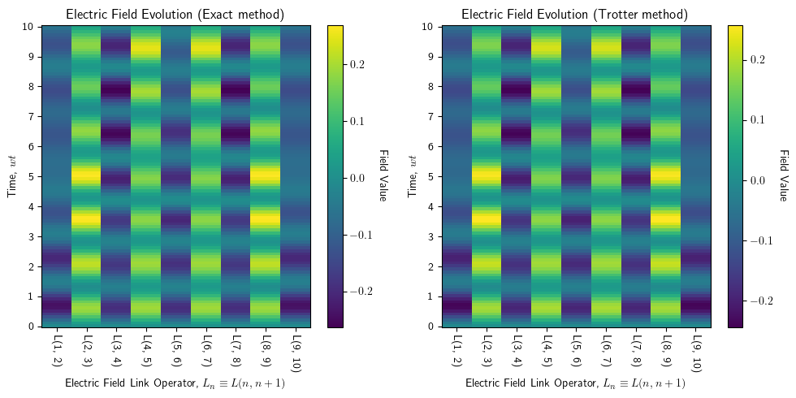

# $U(1)$ Wilson lattice gauge theories in digital quantum simulators 

Numerical simulations of the real time dynamics of Schwinger model ($U(1)$ Wilson lattice gauge theory) mapped to spin lattice system via Jordan-Wigner transformation. We perform the simulation both by exact exponentiation of the Hamiltonian, and also by Trotterization of the Hamiltonian. We present both the results below.

The theory is based on the paper: https://iopscience.iop.org/article/10.1088/1367-2630/aa89ab

The results are as follows, and we can see that it matches the results in the paper.

