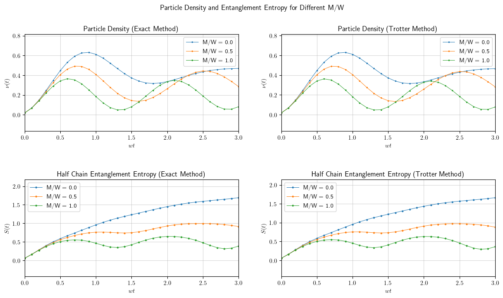
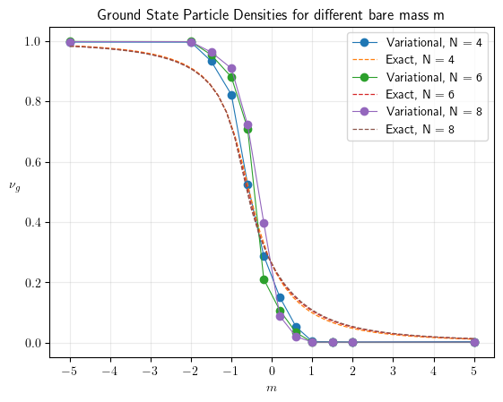
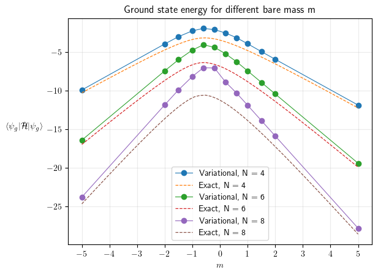

# Numerical simulation of $U(1)$ Wilson Lattice Gauge Model - The Schwinger Model

In this repository, we present the numerical simulations of the Schwinger model, which is a $U(1)$ Wilson lattice gauge theory, by studying the dynamics of the spin-lattice model obtained by the Jordan-Wigner Transformation.

We present both [real-time evolution](#real-time-dynamics) of particle density, entanglement entropy and electric fields for the vacuum of the Schwinger Model, and [variational quantum simulation](#variational-quantum-simulations) and [adiabatic quantum evolution](#adiabatic-quantum-evolution) to obtain the ground state of the model for different mass parameters and observe the phase transitions in the model.

Further, I am working on implementing a [PINN which can be trained to obtain the ground state of the system](#pinn-for-finding-the-ground-state). Preliminarily, I have obtained the phase transition as expected, but there are deviations from the expected values at positive bare masses.

## Real-Time Dynamics

[Jupyter Notebook](num_sim_schwinger.ipynb)

The numerical simulations of the real time dynamics is performed by both exact exponentiation of the Hamiltonian and Trotterization of the Hamiltonian. We present both the results below.

The theory and the experimental results are presented in the paper by Muschik et al.: https://iopscience.iop.org/article/10.1088/1367-2630/aa89ab

The results are as follows, and it can see that it matches the results in the paper.

### Particle Density and Half Chain Entanglement Entropy

### Electric Field

## Variational Approximation of Ground State

[Jupyter Notebook](vqe_gs_schwinger.ipynb)

Entanglement entropy, which quantifies the amount of entanglement (correlation) in a multipartite system, is a very good indicator of phase transitions. It is minimal at regions that are far from phase transitions, and increases as one approaches the critical value of the parameter, with it being maximum at the critical parameter. Therefore, one can approximately obtain the ground state as a (separable) product state, for regions far away from the critical point. 

In this section, we variationally obtain the product state that best approximates the ground state for a given set of Hamiltonian parameters, and quantitatively observe quantities like particle density, order parameter and entanglement entropy, and also quantify the overlap between the variationally obtained product state and the exact state, and also the ground state energy difference for different parameters. 

To obtain the approximate ground state, we parameterize each spin-lattice site by three angles $\theta_x$, $\theta_y$ and $\theta_z$ and obtain the ground state of the Schwinger Model by minimizing the energy of the system. The variational parameters are optimized using the adam method.

> [!Important]
> This method approximates the ground state using only 3N parameters, where N is the number of sites in the lattice, which is a massive improvement over exponential number of parameters required to exactly describe the state. We see that the ground states are approximated to a very good degree by the product states, indicating that the ground state has very less entanglement, except for critical points.
> This method fails for systems whose ground state is a highly entangled state, in which case the Tensor Network methods produce better results.
> The presented method is equivalent to representing the ground state by a Matrix Product State (MPS), with bond order D=1. Therefore, as expected, the entanglement entropy of the state obtained in the variational method is zero.

The experimental results are presented in the paper by Kokail et al.: https://www.nature.com/articles/s41586-019-1177-4

### Gradient Calculation for optimization algorithm

> Please write to me if you find any error in the following analysis

We start with a random state as the initial state and we choose to rotate the state at each site by three angles $\theta_x$ $(R_x)$, $\theta_y$ $(R_y)$, & $\theta_z$ $(R_z)$

$$
R(\vec{\theta})= \left( \exp\left(\frac{i}{2} \sigma_x \theta_{x1} \right)\times \exp\left(\frac{i}{2} \sigma_y \theta_{y1} \right)\times \exp\left(\frac{i}{2} \sigma_z \theta_{z1} \right) \right) \otimes \cdots\otimes \left( \exp\left(\frac{i}{2} \sigma_x \theta_{xN} \right)\times \exp\left(\frac{i}{2} \sigma_y \theta_{yN} \right)\times \exp\left(\frac{i}{2} \sigma_z \theta_{zN} \right) \right)
$$

$$
\implies R(\vec\theta) = R_1(\vec\theta_1)\otimes R_2(\vec\theta_2) \otimes \cdots\otimes R_N(\vec\theta_N)
$$

where $R_i$ denotes rotation matrix acting on site $i$, giving a parameterized state

$$
|\psi(\vec\theta)\rangle = R(\vec\theta)|\psi_{\text{init}}\rangle
$$

In this case, the loss function which we want to minimize is the energy itself, therefore

$$
\mathrm{Loss} = L= \langle \psi(\vec\theta)| H | \psi(\vec\theta)\rangle = L= \langle \psi| R(\vec\theta)^\dagger H  R(\vec\theta)| \psi\rangle
$$

To minimize loss, we employ gradient descent method, in which we iteratively set

$$
\vec\theta = \vec\theta - \alpha {\frac{dL}{d\vec{\theta}}}
$$

with $\alpha$ being the learning rate.

The derivative of loss is given as

$$
\frac{dL}{d\theta_i} = \langle \psi| \frac{dR(\vec\theta)^\dagger}{d\theta_i} H  R(\vec\theta)| \psi\rangle + \langle \psi| R(\vec\theta)^\dagger H  \frac{dR(\vec\theta)}{d\theta_i}| \psi\rangle
$$

The term $\displaystyle \frac{dR}{d\theta_i}$ can be calculated as

$$
\frac{dR}{d\theta_{xi}} =
\cdots\otimes \left(\frac{d \exp((i/2)~\theta_{xi}\sigma_x)}{d\theta_{xi}}\times \exp((i/2)\theta_{yi}\sigma_y)\times \exp((i/2)\theta_{zi}\sigma_z)\right) \otimes \cdots
$$

which is equal to

$$
= \cdots\otimes \left( \frac{i}{2}\sigma_x\times \exp((i/2)~\theta_{xi}\sigma_x)\times \exp((i/2)\theta_{yi}\sigma_y)\times \exp((i/2)\theta_{zi}\sigma_z)\right) \otimes \cdots
$$

and similarly for $yi$ and $zi$

To calculate $\displaystyle \frac{dR^\dagger}{d\theta_i}$, use the fact that $(A\otimes B)^\dagger = A^\dagger \otimes B^\dagger$, giving

$$
R(\vec\theta)^\dagger = R_1(\vec\theta_1)^\dagger\otimes R_2(\vec\theta_2)^\dagger \otimes \cdots\otimes R_N(\vec\theta_N)^\dagger
$$

and therefore

$$
\frac{dR^\dagger}{d\theta_{xi}} =
\cdots\otimes \left(\frac{d \exp((i/2)~\theta_{xi}\sigma_x)}{d\theta_{xi}}\times \exp((i/2)\theta_{yi}\sigma_y)\times \exp((i/2)\theta_{zi}\sigma_z)\right)^\dagger \otimes \cdots
$$

which is equal to

$$
= \cdots\otimes \left( \frac{i}{2}\sigma_x\times \exp((i/2)~\theta_{xi}\sigma_x)\times \exp((i/2)\theta_{yi}\sigma_y)\times \exp((i/2)\theta_{zi}\sigma_z)\right)^\dagger \otimes \cdots
$$

Therefore, we have

$$
\frac{dR^\dagger}{d\theta_i} = \left( \frac{dR}{d\theta_i}  \right)^\dagger
$$

By iteratively obtaining the gradients and setting the $\theta\text{s}$ for the theory, we obtain the ground state of the Schwinger Model.

### Results

I have implemented, so far, the gradient descent, stochastic gradient descent and adam optimizers, with cosine annealing and exponential learning rate schedulers. The results below are the results for adam optimizer with cosine annealed learning rate, and with injected noise.

The noise injection and cosine annealing of the learning rate is done so that the optimizer can visit a huge portion of the configuration space, and not get stuck in a local minima.

> TODO #1: Quantify the error in the ground state energy and the angles.

> TODO #2: Stopping condition for the gradient descent has been set to `max(gradient) < 1e-5`. Verify if this stopping condition is sufficient.

The following are the results obtained. (`Exact` stands for values obtained from the exact diagonalization of the Hamiltonian)

### Particle Density

### Order Parameter

We can see that there is a phase transition around $m_c \approx -0.7$ `(Byrnes, T., Sriganesh, P., Bursill, R. & Hamer, C. Density matrix renormalization  group approach to the massive Schwinger model. Nucl. Phys. B 109, 202–206  (2002). )`

We also see that for negative bare mass, it is energetically favourable to have particle excitations, which leads to non vanishing ground state particle density.

### Ground State Energy

We see that the ground state energy is symmetric around $m_c \approx -0.7$, and the difference between the exact energy and the approximate energy grows with $N$.

### Entanglement Entropy

As expected from the phase transitions, entanglement entropy at masses away from $m_c$ is close to zero, therefore indicating that the obtained product states are very good approximations for the exact ground state, while for $m$ close to $m_c$, the entanglement entropy is large, indicating that the product states are not good approximations for the exact ground state.

### Wavefunction Overlap

We see that for $m$ away from $m_c$, the overlap is close to 1, and for $m$ close to $m_c$, the overlap is close to 0, which is expected.

### Energy Difference

## Adiabatic Quantum Evolution

[Jupyter Notebook](adiabatic_evolution_gs_schwinger.ipynb)

The adiabatic quantum evolution method is a method to obtain the exact ground state of a system. In the adiabatic quantum evolution method to obtain the ground state of the Schwinger Model, we consider a time dependent Hamiltonian

$$
H(t) = \alpha(t) ~H_{\text{Schwinger}} + \beta(t) ~H_{\text{driving}}
$$

where $\alpha + \beta = 1$ and the driving Hamiltonian is a simple hamiltonian that does not commute with the Schwinger Hamiltonian.

The $\alpha$ and $\beta$ are chosen to be function of time such that $\alpha(0) \ll \beta(0)$ and $\alpha(T) \gg \beta(T)$, so that the system initially starts out dominated by the driving Hamiltonian and ends up dominated by the Schwinger Hamiltonian.

The initial state of the system is chosen to be the ground state of the driving Hamiltonian. We then let the state to evolve according to the time dependent Hamiltonian. If the Hamiltonian varies slowly, such that the time evolution of the state takes place adiabatically, then the state will remain in the ground state of the time dependent Hamiltonian, and therefore, the final state will be the ground state of the Schwinger Hamiltonian.

In our simulation, we choose the $\alpha$ and $\beta$ to change by `1/num_steps` for every one second of evolution of the state. We then obtain the ground state of the Schwinger Model by evolving the state for a total time of `num_steps` seconds.

We see that it outperforms the variational method in terms of computational requirements. It also manages to reach the entangled ground states, which were not accessible by the variational method.

The results are as follows:

### Particle Density

### Order Parameter

### Ground State Energy

## PINN for finding the ground state

[Jupyter Notebook](PINN_schwinger-in_progress.ipynb)

The PINN takes as input the number $n \in \{1, 2, \cdots, 2^N\}$, indicating the basis $| n \rangle^\dagger = (0,0,\cdots,1_\text{at n}, \cdots, 0,0)$ and outputs the complex amplitude corresponding to the basis.

The training is done by taking the expectation value of the hamiltonian as the loss function, to obtain the state where energy is minimum.

> TODO #1: Fix the problem with convergence. Current model does not exactly converge, and still displays fluctuations even after large epochs.

> TODO #2: Quantify the stopping condition. Current model runs the training loop without stopping at any condition.

The approximate ground state particle densities obtained by this preliminary model is as follows:

